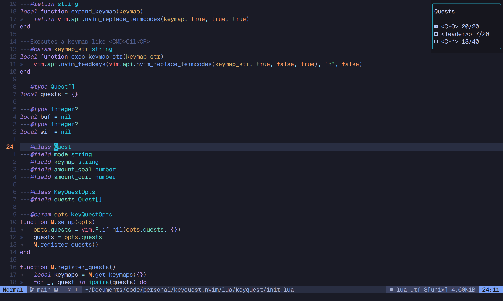

# keyquest.nvim



## Setup

Using lazy
```lua
	{
		"AlexanderHOtt/keyquest.nvim",
		opts = {
			quests = {
				{ mode = "n", keymap = "<C-O>", amount_goal = 20, amount_curr = 0 },
				{ mode = "n", keymap = "<leader>o", amount_goal = 20, amount_curr = 0 },
			},
		},
		config = function(_, opts)
			local keyquest = require("keyquest")
			keyquest.setup(opts)
			keyquest.toggle() -- open by default
			vim.keymap.set("n", "<leader>kq", keyquest.toggle)
		end,
	},
```
